# Prestige Foods & Lounge

A full-stack restaurant and snooker lounge web application built with HTML, CSS, JavaScript, PHP, and MySQL.

## About the Project

Prestige Foods & Lounge is a full-stack web application that combines a restaurant ordering system with a snooker competition and registration platform.

Customers can browse restaurant products, create accounts, add items to a cart, place orders, make online payments, and track their orders.

The platform also includes a snooker section where users can view competitions, register for competitions, make payments, view registered players, and explore the Hall of Champions.

An administrative system is included for managing restaurant products, customers, orders, order statuses, and snooker competitions and winners.

## Features

### Customer Features

- User registration and login
- Product browsing and search
- Product filtering
- Shopping cart
- Checkout
- Delivery details
- Order placement
- Order tracking
- My Orders
- Password reset
- Online payment integration
- Payment verification

### Snooker Features

- View available snooker competitions
- Competition details
- Competition registration
- Snooker registration payment
- Payment verification
- View registered players
- View personal registrations
- Terms and conditions
- Hall of Champions
- View previous winners

### Admin Features

- Admin authentication
- Admin dashboard
- Product management
- Add products
- Edit products
- Delete products
- Product image uploads
- Customer management
- Order management
- Order details
- Order status management
- Payment status management
- Snooker competition management
- Edit competitions
- Manage snooker registrations
- Manage snooker winners
- Edit snooker winners
- Delete snooker winners
- Admin logout

### Screenshots

### Restaurant

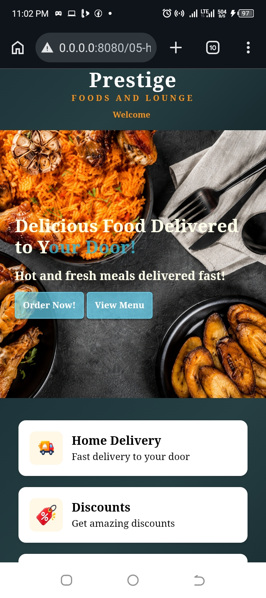

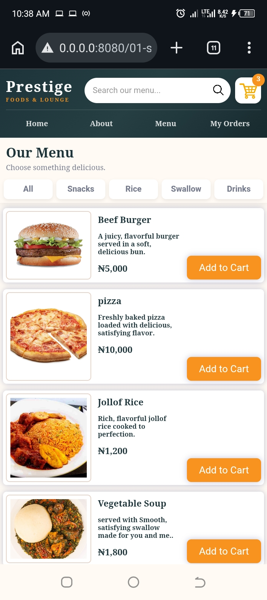

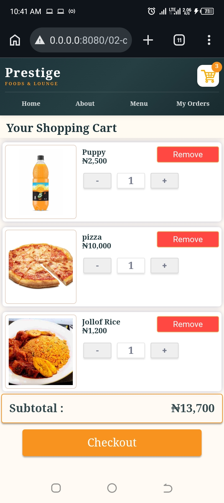

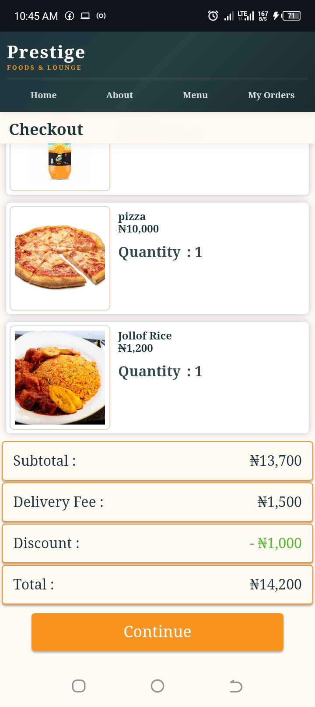

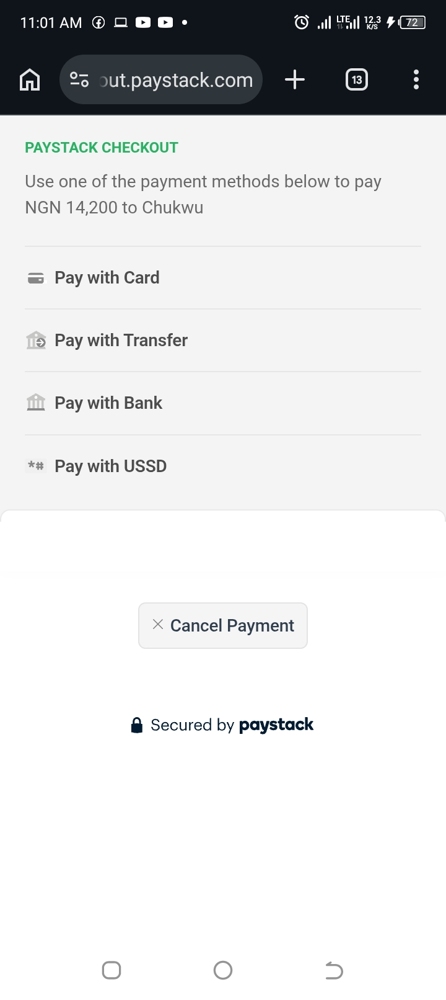

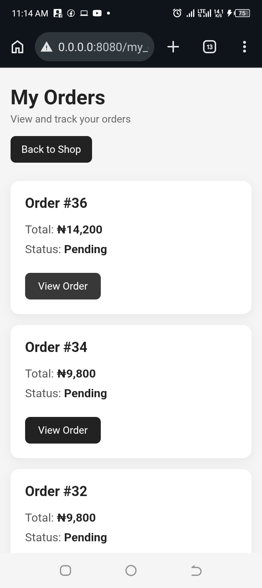

### Admin

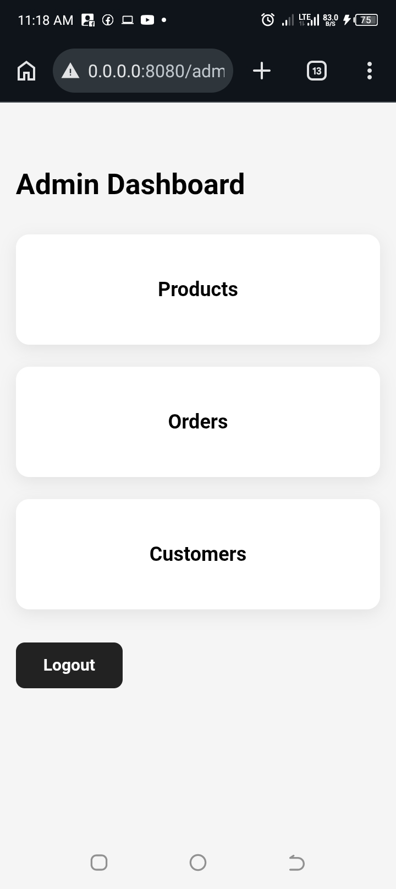

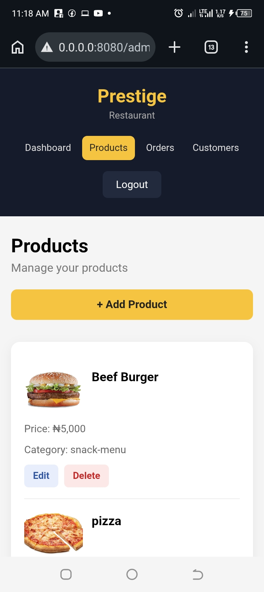

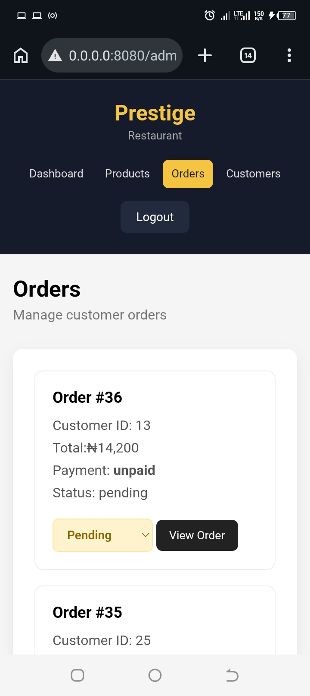

### Snooker

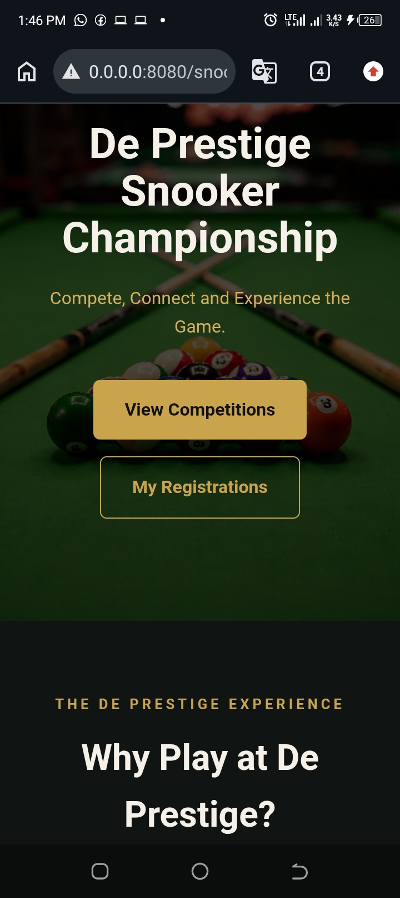

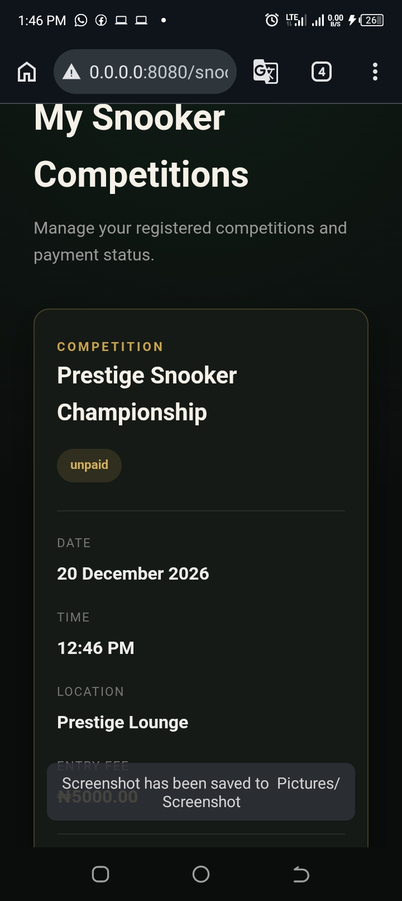

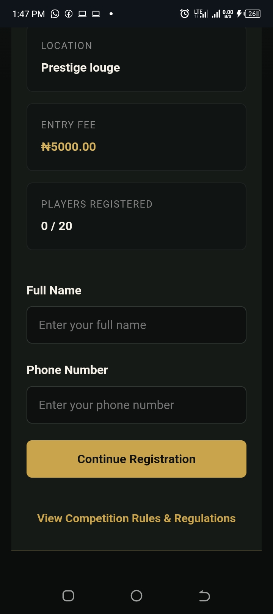

## Technologies Used

- HTML
- CSS
- JavaScript
- PHP
- MySQL
- PDO
- Paystack
- Git
- GitHub

## Backend

The backend is built with PHP and uses PDO to communicate with a MySQL database.

The database stores information such as:

- Users
- Products
- Orders
- Order items
- Password reset tokens
- Snooker competitions
- Snooker registrations
- Snooker winners

## Payment

The project includes Paystack payment integration with server-side payment verification and amount verification.

Both restaurant orders and snooker competition registrations use payment processing and server-side verification.

## Security

Sensitive configuration files and credentials are kept out of the public GitHub repository using `.gitignore`.

Passwords are securely stored using PHP password hashing.

Payment credentials are kept in a private configuration file and are not included in the public repository.

## Project Status

The core restaurant ordering system, administration system, database functionality, authentication, password reset, payment flow, and snooker competition system have been implemented and tested locally.

The project is currently being prepared for deployment to a live hosting environment.

## Future Improvements

- Deploy the application to a live hosting environment
- Add a custom domain
- Improve the user interface and responsiveness
- Continue improving security and production configuration
- Add additional features as the project grows

## Author

**James Uchenna**

This project was developed as a practical full-stack web development project while learning PHP, MySQL, JavaScript, and backend development.